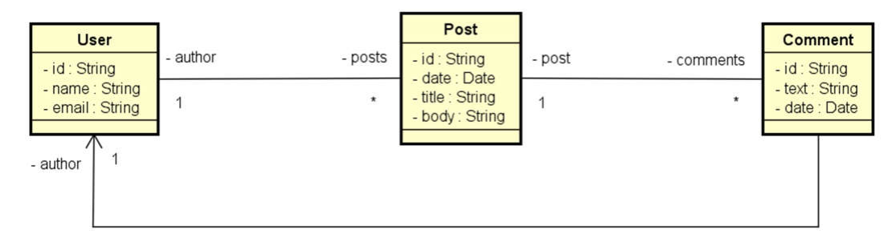
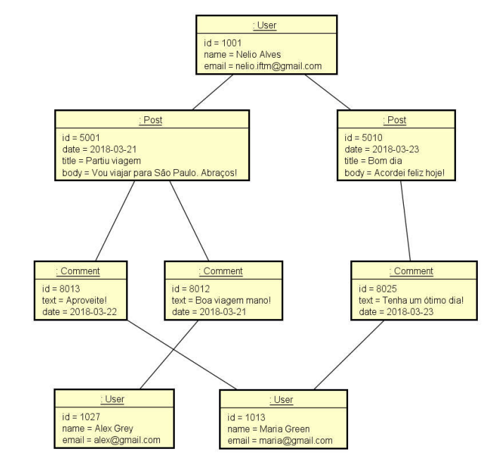
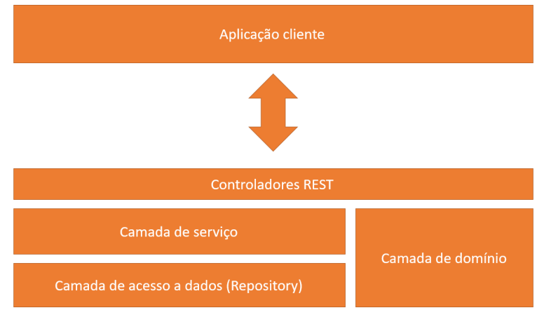

# Spring Boot com MongoDB

[](https://github.com/lucas-csoares/workshop-springboot3-jpa/blob/main/LICENSE)

# Sobre o projeto

Spring boot com MongoDB é uma aplicação Back-End cuja principal finalidade é praticar conceitos de banco de dados não relacional. 

## Objetivo Geral

- Compreender as principais diferenças entre paradigma orientado a documentos e relacional
- Implementar operações de CRUD
- Refletir sobre decisões de design para um banco de dados orientado a documentos
- Implementar associações entre objetos
  - Objetos aninhados
  - Referências
- Realizar consultas com Spring Data e MongoRepository

## Modelo Conceitual

### Modelo de domínio



### Instância de domínio



### Camadas lógicas



# Tecnologias usadas

## Back-End

- Java
- Spring Boot
- Spring Data MongoDB
- Postman
- Apache Tomcat
- Maven

## Banco de dados

- MongoDB

# Como executar o projeto

## Back-End

Pré-requisitos: Java 21

```bash
# clonar repositório
git clone git@github.com:lucas-csoares/mongodb-springBoot.git

# executar o projeto
./mvnw spring-boot:run
```

# Autor

Lucas Cabral Soares


